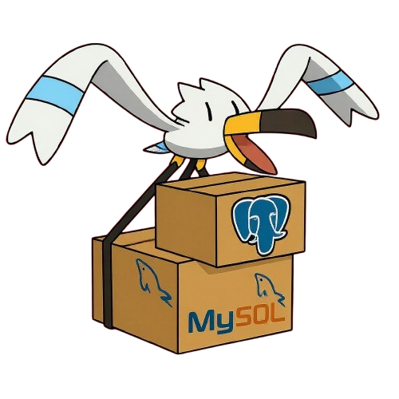

<p align="center">
  
  <h1 align="center">seagle</h1>
</p>

AI-powered PostgreSQL/MySQL database management tool built with Wails (Go + React/TypeScript).

## Overview

Seagle is a modern desktop application for database management, designed as an alternative to tools like JetBrains DataGrip. It combines traditional database management capabilities with AI-powered query generation using OpenAI's GPT-4o model.

## Features

### Database Management
- PostgreSQL and MySQL compatibility
- Form-based and connection string configurations with SSL support
-Hierarchical tree view of databases, tables, and columns
- Full SQL editor with execution and results display

## Getting Started

### Prerequisites
- Go 1.23 or later
- Node.js 18 or later
- Wails CLI v2.10.2

### Installation
1. Clone the repository
2. Install dependencies: `go mod tidy && cd frontend && npm install`
3. Configure OpenAI API key in settings (optional, for AI features)

### Development
```bash
# Start development server with hot reload
wails dev

# Or use make command
make run
```

### Build
```bash
# Build production executable
wails build

# Or use make command
make build
```

## Project Structure

```
seagle/
├── main.go                    # Application entry point
├── app.go                     # Wails app configuration
├── core/                      # Backend business logic
│   ├── domain/                # Domain entities and interfaces
│   ├── services/              # Application services
│   └── infra/                 # Infrastructure implementations
├── frontend/                  # React/TypeScript frontend
│   ├── src/
│   │   ├── components/        # UI components
│   │   ├── store/             # State management
│   │   └── contexts/          # React contexts
│   └── package.json           # Frontend dependencies
└── wails.json                 # Wails configuration
```
